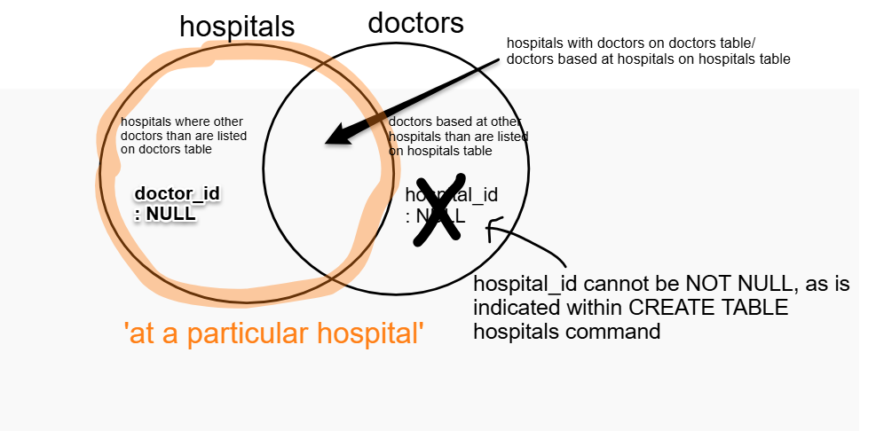
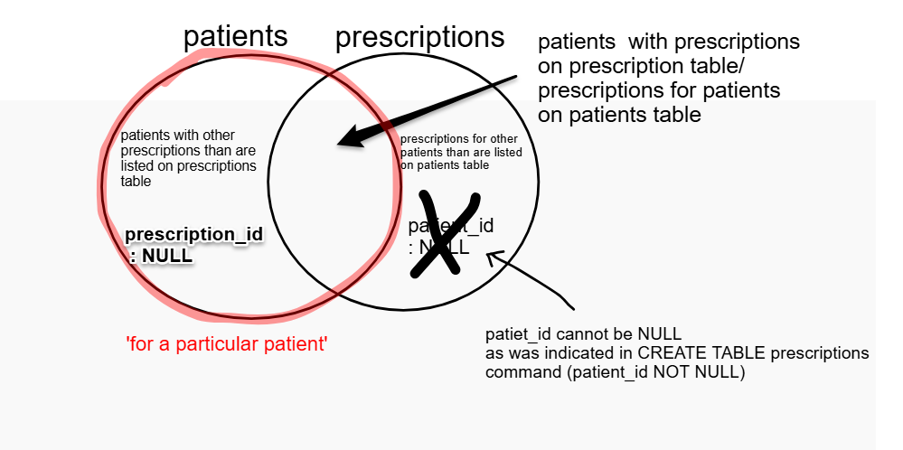
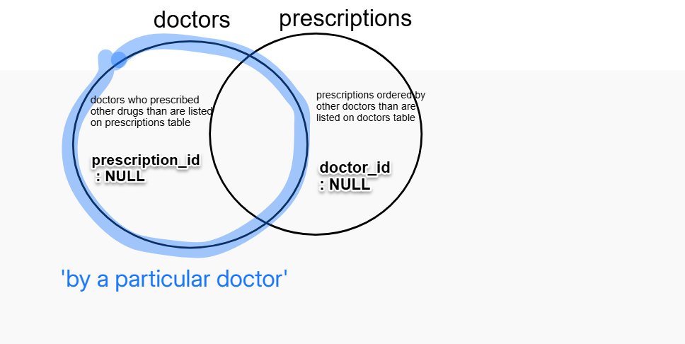
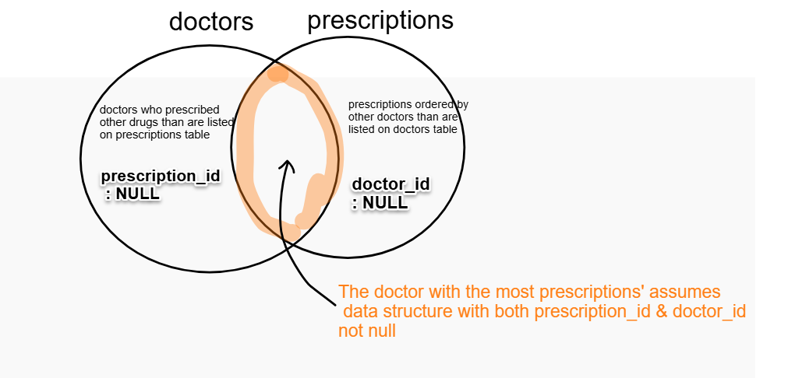
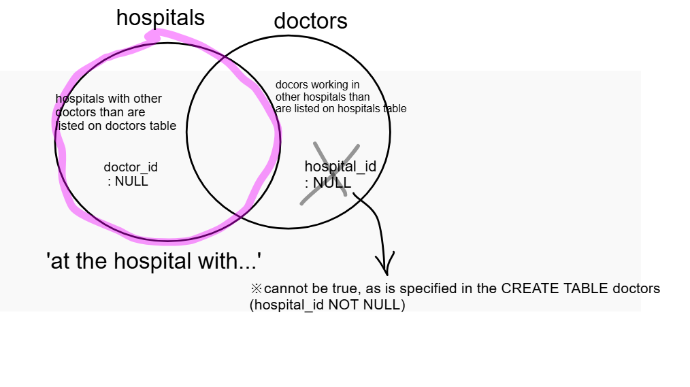

# Part1. Create a new database
## 1. Locate the provided CSV files on local directory
* use linux commands (ls, cd) and located;
* doctors.csv 
* hospitals.csv
* patients.csv
* prescriptions.csv
  
## 2. Examine the files to check the data structure
* check all the columns in each of the csv files, by a linux command; head-5

## 3. Identify entities:
* doctors
* hospitals
* patients
* prescriptions

## 4. Determine primary keys: 
* doctors.person_id
* hospitals.hospital_id
* patients.person_id (starting from 101)
* prescriptions.prescription_id

## 5. Consider relationships between each entity:
* One doctor is assigned to one hospital
* There may be multiple doctors working at one hospital
* One doctor can be assigned to multiple patients.
* One patient is assigned to one doctor
* There may be multiple prescriptions for one patient.
* One prescription is assinged to one patient.
* One prescription is assinged to one doctor, and therefore one hospital
* There may be multiple prescriptions in one hospital
* There may be multiple prescriptions made by one doctor
* One prescription is assinged to one doctor
* Multiple patients may be registered in one hospital
* One hospital can register muptiple patients
  
## 6. Connect to MySQL from my local directory
* execute the linux command to access MySQL

## 7. Specify a database to work on within MySQL
* specicy 'assessment1' in my local directory

## 8. Create tables:
* doctors
* hospitals
* patients
* prescriptions

## 9. Define appropriate datatypes for each column:
* INT UNSIGNED for IDs and size
* VARCHAR for names, addresses, roles, type, and medication
* DATE for date fields
* NOT NULL AUTO_INCREMENT for primary keys
* AUTO_INCREMENT = 101 for patients.person_id

## 10. Load the CSV files into tables in MySQL from local directory 
* execute a SQL command; LOAD DATA LOCAL INFILE
   
## 11. Create additional joined table;
* patients_to_doctors
* use a SQL command; CREATE TABLE patients_to_doctors AS SELECT, to input the joined information at the same time
* INNER JOIN
* distinguish between names, dates of birth and addresses of patients and doctors, by using AS within SELECT clause (i.e. patients.name AS patient_name)

## 12. Verify outputs
* execute; SELECT * FROM;, to check the tables with data

## 13.  Export the new database to local directory
* Name the new directory in the .sql file as 'assessment1_database.sql'
* execute the command; mysqldump -u hds -p assessment1 > assessment1_database.sql, in local directory, after exitting MySQL

# Part2. Write SQL queries to extract specific data 
## 1. Print a list of all doctors based at a particular hospital
* connect hospitals & doctors - LEFT JOIN;

* mind duplicated columns; (some columns such as name are the same in the two tables while the values are different), and rename them using AS to avoid confusion
* specify hospitals by its primary key, which is a unique identifier, rather than only its name; SELECT hospitals.hospital_id, hospitals.name

## 2. Print a list of all prescriptions for a particular patient, ordered by the prescription date
* connect patients & prescriptions- use LEFT JOIN;
  

## 3. Print a list of all prescriptions that a particular doctor has prescribed
* connect doctors & prescriptions - use LEFT JOIN;

## 4. Add a new patient to the database, including being registered with one of the doctors
* use INSERT INTO VALUES
  
## 5. Identify which doctor has made the most prescriptions
* connect prescriptions & doctors - INNER JOIN;

* use GROUP BY and COUNT to compare the numbers of prescriptions
* specify doctors by its primary key, which is a unique identifier, rather than only its name; SELECT doctors.person_id, doctors.name

## 6. Print a list of all doctors at the hospital with biggest size (number of beds)
* connect hospitals & doctors - use LEFT JOIN;

* use SELECT MAX FROM to get the maximum value of hospitals.size
